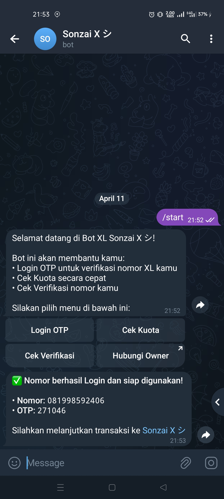
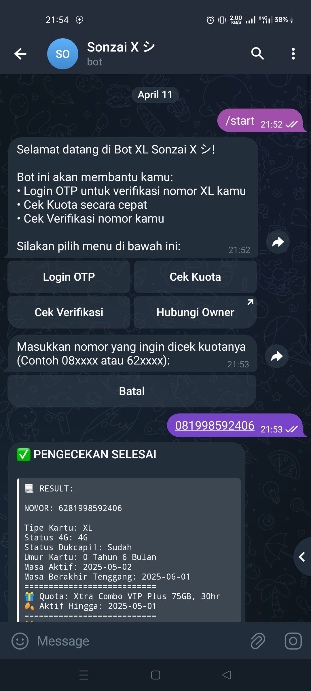
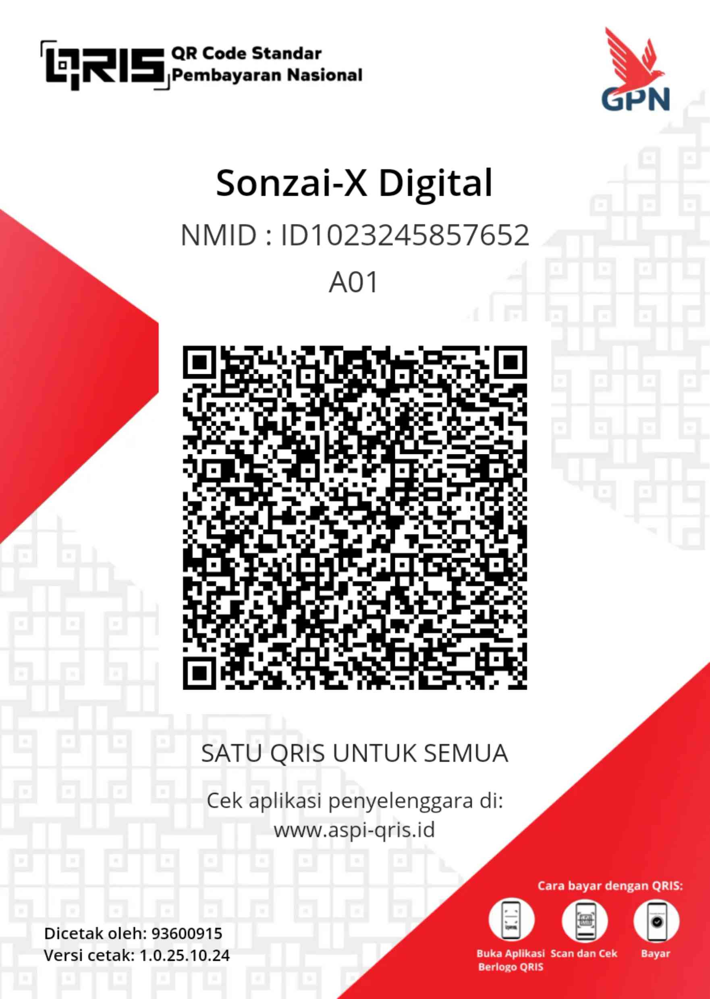

# KMSP BOT

KMSP BOT adalah sebuah bot yang dibuat dengan Node.js. Untuk memudahkan Seller KMSP STORE melakukan OTP di Telegram

Untuk KMSP Full Feature masih dalam pengembangan

## Requirement
1. Install Node.js versi current melalui [NodeSource](https://github.com/nodesource/distributions)

2. [MongoDB](https://www.mongodb.com) ( untuk menyimpan data pengguna yang dibutuh berfungsi mengirim pesan broadcast )

## Instalasi & Run Bot
```bash
git clone https://github.com/SonzaiEkkusu/KMSP-BOT
cd KMSP-BOT
npm install
npm start
```
## Konfigurasi
Sebelum menjalankan bot, lakukan konfigurasi pada file config.js. Berikut contoh konfigurasi:
```node
module.exports = {
    TOKEN: 'BOT_TOKEN',             // Ganti dengan token bot yang kamu miliki
    SELLER_CODE: 'SELLER_KODE_KMSP',  // Ganti dengan kode penjual bot
    OWNER_NAME: 'Sonzai X シ',        // Nama pemilik bot
    OWNER_USERNAME: 'November2k',    // Username pemilik bot
    OWNER_ID: '679008122',           // ID dari pemilik bot
    MONGO_DB: 'MONGO_DB_URL'         // URL koneksi MongoDB (misal: mongodb://user:password...)
};
```
Jika bot berjalan dengan benar, akan muncul pesan di terminal.
```bash
[INFO] Bot dimulai... Menunggu koneksi dari MongoDB.
[INFO] Terkoneksi ke MongoDB silahkan cek bot telegram anda.
```
| Login OTP | Cek Verifikasi | Cek Kuota |
|-----------|----------------|-----------|
|  |  |  |

```cmd
/start - untuk menampilkan menu
/broadcast - untuk mengirim pesan ke semua pengguna bot
```
## Kontribusi
Kontribusi sangat dihargai! Jika kamu memiliki ide, perbaikan, atau menemukan bug, silakan beritahu ke Telegram [Sonzai X シ](https://t.me/November2k)

## Disclaimer
```
Pembuatan bot ini hanya untuk kesenangan dan kemudahan saya pribadi tidak untuk merugikan atau menyaingi pihak tertentu!
```
## Credits
[Penyedia API](https://nomorxlku.my.id)

[KMSP STORE](https://kmsp-store.com/)

[Sonzai X シ](https://t.me/November2k)
## Donasi

